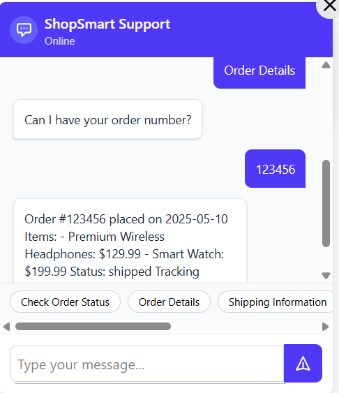
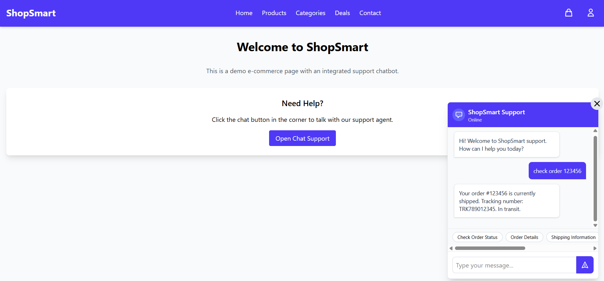

# Dialogflow E-commerce Support Chatbot

A comprehensive e-commerce customer support chatbot built with Google Dialogflow, Express.js backend, and React frontend. This chatbot can handle common e-commerce customer service tasks such as checking order status, providing shipping information, explaining return policies, and offering product recommendations.



## Features

- **Order Status Tracking**: Check the status of orders by order number
- **Order Details**: Get detailed information about orders
- **Shipping Information**: Provide shipping options and estimated delivery times
- **Return Policy**: Explain return policies for different product categories
- **Product Recommendations**: Suggest products based on category or previous purchases
- **FAQs**: Answer frequently asked questions about various topics

## Tech Stack

### Backend
- **Node.js** with **Express.js** for the server
- **Dialogflow** for natural language processing and intent recognition
- **Google Auth Library** for authentication with Google services

### Frontend
- **React 19** with **TypeScript** for UI development
- **TailwindCSS** for styling

## Screenshots

### Demo Website with Chatbot


## Setup Instructions

### Prerequisites
- Node.js (v14 or later)
- Google Cloud account with Dialogflow ES enabled
- Service account with Dialogflow API access

### Backend Setup

1. Navigate to the backend directory:
   ```
   cd backend
   ```

2. Install dependencies:
   ```
   npm install
   ```

3. Create a `.env` file in the backend directory with the following variables:
   ```
   DIALOGFLOW_PROJECT_ID=your-dialogflow-project-id
   PORT=5000
   ```
   Note: The `DIALOGFLOW_PROJECT_ID` can be found in the Google Cloud Console or in the Dialogflow Console settings.

4. Place your Google service account key file in the backend directory as `service-account.json` (see Dialogflow Setup section for instructions on generating this file)

5. Start the backend server:
   ```
   npm run dev
   ```

### Frontend Setup

1. Navigate to the frontend directory:
   ```
   cd frontend
   ```

2. Install dependencies:
   ```
   npm install
   ```

3. Start the development server:
   ```
   npm run dev
   ```

4. The application will be available at `http://localhost:5173`

## Dialogflow Setup

### Creating a Dialogflow Agent

1. **Create a Google Cloud Project**:
   - Go to the [Google Cloud Console](https://console.cloud.google.com/)
   - Click "New Project" and follow the steps to create a new project
   - Note down the Project ID as you'll need it for environment variables

2. **Enable Dialogflow API**:
   - In Google Cloud Console, go to "APIs & Services" > "Library"
   - Search for "Dialogflow API" and enable it

3. **Create a Dialogflow Agent**:
   - Go to the [Dialogflow Console](https://dialogflow.cloud.google.com/)
   - Click "Create Agent" and link it to your Google Cloud project
   - Set the default language to "English (en)"

### Importing the Pre-configured Agent (Recommended)

1. **Download the Agent ZIP File**:
   - The project already includes a pre-configured Dialogflow agent in `public/Ecommerce-Support-Bot.zip`

2. **Import the Agent**:
   - In the Dialogflow Console, click the gear icon next to the agent name to access settings
   - Go to the "Export and Import" tab
   - Click "IMPORT FROM ZIP" and select the `Ecommerce-Support-Bot.zip` file
   - Type "IMPORT" to confirm and click "Import"

### Setting Up Service Account Credentials

1. **Create Service Account**:
   - In Google Cloud Console, go to "IAM & Admin" > "Service Accounts"
   - Click "Create Service Account"
   - Name it "dialogflow-client" (or your preferred name)
   - Grant the role "Dialogflow API Client" to the service account

2. **Generate Service Account Key**:
   - Click on the service account you just created
   - Go to the "Keys" tab
   - Click "Add Key" > "Create New Key"
   - Choose JSON format and click "Create"
   - The key file will be downloaded to your computer

3. **Add Service Account Key to Project**:
   - Rename the downloaded file to `service-account.json`
   - Place it in the `backend/` directory of this project
   - **IMPORTANT**: Never commit this file to version control. It contains sensitive credentials.

### Configuring Webhooks for Fulfillment

1. **Set Up ngrok for Local Testing**:
   - Download and install [ngrok](https://ngrok.com/download)
   - Create a free ngrok account to get an auth token
   - Authenticate ngrok using your token:
     ```powershell
     .\ngrok.exe authtoken YOUR_AUTH_TOKEN
     ```
   - Start ngrok to create a tunnel to your local Express server:
     ```powershell
     .\ngrok.exe http 5000
     ```
   - Note the HTTPS URL provided by ngrok (e.g., `https://abc123.ngrok.io`)

2. **Configure Webhook in Dialogflow**:
   - In the Dialogflow Console, go to "Fulfillment"
   - Enable the webhook
   - Set the URL to your ngrok HTTPS URL + `/webhook` (e.g., `https://abc123.ngrok.io/webhook`)
   - Under "Fulfillment", enable webhook for all the intents that require database access

3. **Enable Webhook for Intents**:
   - For each of these intents, make sure webhook is enabled:
     - Check Order Status
     - Order Details
     - Shipping Information
     - Return Policy
     - Product Recommendations
     - FAQs

### Testing the Integration

1. **Verify Webhook Connection**:
   - Ensure your Express backend is running (`npm run dev` in the backend directory)
   - Ensure ngrok is running and pointing to port 5000
   - In Dialogflow Console, go to the "Try it now" panel
   - Type "What's the status of order 12345?" or similar query
   - You should see a response from your webhook (check terminal logs if there are issues)

2. **Test in Your Frontend**:
   - With everything running, open your frontend application
   - Try various queries to test the different intents
   - Check the backend console for any errors

## Project Structure

- `backend/`: Express.js server with Dialogflow integration
  - `server.js`: Main server file with routes
  - `databaseUtils.js`: Functions to interact with the mock database
  - `mockDatabase.js`: Mock database for development

- `frontend/`: React application with TypeScript
  - `src/`: Source files
    - `Chatbot.tsx`: Main chatbot component
    - `App.tsx`: Root application component

## License

This project is licensed under the MIT License - see the LICENSE file for details
